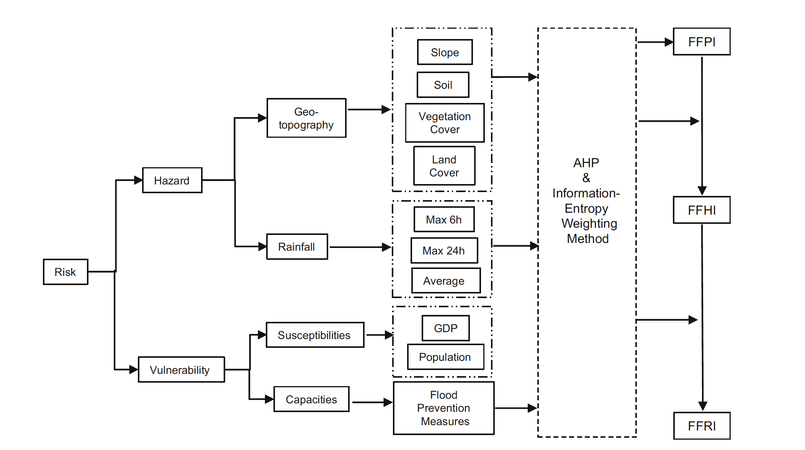

# Flash Flood Index

__Zeng, Z., et al. (2016). "A cascading flash flood guidance system: development and application in Yunnan Province, China." Natural Hazards 84(3): 2071-2093.__

In this paper, the author proposed a framework which integrates data from precipitation, DEM, GPD etc. With these information, they take advantage of information entropy approach to assign different weights to each category. After that, they came up with an index map covering Yunnan province in China to assess the susceptibility of flash flood.

 

__[Mapping Flash Flood Severity in the United States](https://journals.ametsoc.org/view/journals/hydr/18/2/jhm-d-16-0082_1.xml)__

First study to derive the flashiness index over the continetnal US by utlizing machine learning trained on stream gauges.

  

__Ombadi, M., et al. (2018). "Developing Intensity-Duration-Frequency (IDF) Curves from Satellite-based Precipitation: Methodology and Evaluation" Water Resources Research__

In this paper, the author tried to develop IDF curve through 3 steps: 1. bias adjustment, 2. Point-to-Area transformation, 3. develop IDF curve with IR satellite data PERSIANN-CDR. The results are compared with NOAA Atlas 14.

The adjustment of bias is related to altitude because the author found the bias is increasing with elevation for IR satellite precipitation products.

__Maddox, R. A. Chappell, C. F. and Hoxit, L. R. (1979). "Synoptic and Meso-$\alpha$ Scale Aspects of Flash Flood Events." Foucs on Forecasting.__

Author analyzed synoptic and mesoscale flash flood occuring in the US from 1973 to 77. He found that places frequently having flash flooding share the same features:
  1. Heavy rains were produced by convective storms. (from W to E, convective storms are more dominant)
  2. Surface dewpoint temperatures were very high.
  3. Large moisture contents were present through a deep trpospheric layer.
  4. Vertical wind shear was weak to moderate through the cloud depth.

__Dowswell III, C. A., H.E. Brooks, R.A. Maddox (1996). "Flash Flood Forecasting: An Ingredients-Based Methodology." Weather and Forecast(11): 560-581.__

Key ingredients that affect flash floods:
  1. The heaviest precipitation occurs where the rainfall rate is highest for longest time.
  2. precipitation efficiency is important: the ratio of the mass of water falling as precipitation to the influx of water vapor loss into the cloud.
  3. Heavy rain rates are most often occur with deep convection - the atmosphere must be conditionally unstable and significant lift must occur to lift the airmass through the level of free convection (LFC).
  4. The heavy precipitation must remain quasi-stationary.

__[Leveraging machine learning for predicting flash flood damage in the Southeast US](https://iopscience.iop.org/article/10.1088/1748-9326/ab6edd/meta)__

Environmental Research Letters

The author attempted to train an ensemble ML models to predict the flash flood damages among which they also used ANN to fill the gaps of median household values for the U.S. citizens. They eventually achieved reasonably good result for their models. But I had some insights of it:

1. For the binary classification, the author presented a ROC curve to demonstrate the accuracy but as they didn't mention the distribution of the data sample, meaning that it could be biased because of the sample distribution;

2. For the regression model, I'm wondering if train the network based upon the result of classfication would be better because it is a way to reduce trainable data and also people are not aware of which no damage caused in the event;

__[Flash Flood Risk Assessment in the Context of Economic Change Scenarios](https://journals.ametsoc.org/view/journals/wcas/15/1/WCAS-D-21-0141.1.xml)__

The authors used a flood inundation model to retrospectively analyze one flash flood event and associate it with economic losses. They used GDP by different CMIP models to project future economic losses by a similar event.
