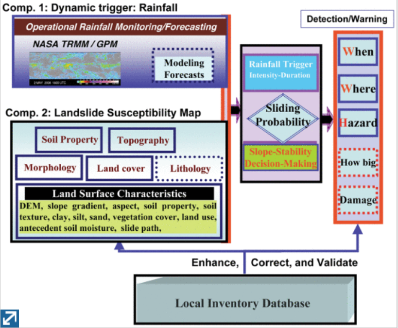

__Kirschbaum, D. and T. Stanley (2018). "Satellite-Based Assessment of Rainfall-Triggered Landslide Hazard for Situational Awareness." Earth's Future 6(3): 505-523.__

The author used IMERG NRT and TRMM NRT satellite QPE to feed into landslide model to triger forecast. It has been found that
 IMERG NRT QPE tends to be improved in detection landslide than TRMM.

__Y. Hong, R. F. Adler and G. Huffman, "An Experimental Global Prediction System for Rainfall-Triggered Landslides Using Satellite Remote Sensing and Geospatial Datasets," in IEEE Transactions on Geoscience and Remote Sensing, vol. 45, no. 6, pp. 1671-1680, June 2007.__

In this paper, a framework predicting landslides is proposed, taking hydrostatic variables (i.e., soil type, DEM, surface, and etc.) and
dynamic variables (i.e., precipitation with TMPA). Specifically, precipitation intensity-duration curve is constructed both reginally and worldwide
 to support decision-making.
