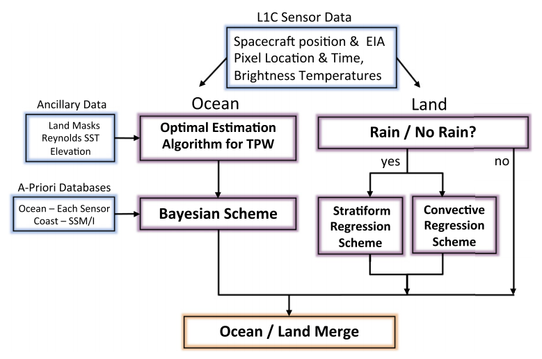

# GPM-IMERG

Algorithm description:

IMERG data combined precipitation estimation from Passive Microwave (PMW) sensors comprising the GPM CO and then merged into half-hourly 0.1 by 0.1 degree fields using Goddard Profiling Algorithm (Olson, Yang, Stout, & Grecu, 2007) and intercalibrated with the GPM Combined Ku Radar-Radiometer Algorithm (CORRA) product [Grecu et al., 2016](https://journals.ametsoc.org/doi/10.1175/JTECH-D-16-0019.1). To fill in the gaps between PMW overpasses, the merged half-hourly 0.1°×0.1° is further recalibrated with Climate Prediction Center (CPC) Morphing-Kalman Filter (CMORPH-KF) Lagrangian time interpolation [Joyce & Xie, 2011](https://journals.ametsoc.org/doi/full/10.1175/JHM-D-11-022.1) and Precipitation Estimation from Remotely Sensed Information using Artificial Neural Networks Cloud Classification System (PERSIANN-CCS) [Hong, Hsu, Sorooshian, & Gao, 2004](https://journals.ametsoc.org/doi/full/10.1175/JAM2173.1). 
IMERG data archive consists of three stages, the first two is near-real-time as Early Run (~4 hour latency) and Late Run (~14 hour latency), and the latter post-analysis Final Run (~3.5 months latency). Early run uses only forward morphing, while late run and final run include both forward and backward morphing. Final run also incorporates monthly gauge adjustment with Global Precipitation Climatology Project (GPCP) at 1° grid box [Adler et al., 2003](https://journals.ametsoc.org/doi/full/10.1175/1525-7541%282003%29004%3C1147%3ATVGPCP%3E2.0.CO%3B2).


 
__Skofronick-Jackson, G., et al. (2017). "The Global Precipitation Measurement (Gpm) Mission for Science and Society." Bull Am Meteorol Soc 98(8): 1679-1695.__

This paper provides an overview about GPM and its auxiliary products (IMERG). It mentioned some constraints about GPM core constellation. 
 1. DPR has detectable rainfall range of (0.22, 110) mm/hour.
 2. GMI has detectable rainfall range of (0.2, 60) mm/hour.
 
and also some ground validation efforts e.g. with gauges, with mrms radars (conditional bias) to show whether it satisfies the goal.

At last, it wraps up some real-world applications of using GPM (IMERG) data.

[A Novel Approach to Identify Sources of Errors in IMERG for GPM Ground Validation](https://journals.ametsoc.org/doi/full/10.1175/JHM-D-16-0079.1)

A novel approach in evaluating the error is by using multiplicative error model:
```latex
y_i=e^{\alpha} x_{i}^{\beta} e^{\epsilon}
```
where \alpha (best=0) represents the factor that systematically overestimate/underestimate, \beta is tge exponent, \epsilon quantifies the random error;

In this article, the authors decomposed all sources that IMERG use to intercompare its performance contrasting gauge and MRMS.

Conclusions:
	1. IR source has higher misses and lower detection. (0.9% of the observations are due to IR but more in winter)
	2. the tendency for IMERG to underestimate rain occurences is common to all PMW instruments.
	3. In rain rates, TMI and AMSR have relatively low random error but AMSR has higher bias.
	4. sounder (MHS) performs poorly but slightly better than SSMI (prone to outliers);
	5. IMERG overestimates light rain (drizzle) and underestimate heavy rainfall;

# GPM-GSMAP

__Hanqing Chen, Bin Yong, Jonathan J. Gourley, Jiufu Liu, Liliang Ren, Weiguang Wang, Yang Hong, Jianyun Zhang,
Impact of the crucial geographic and climatic factors on the input source errors of GPM-based global satellite precipitation estimates, Journal of Hydrology, Volume 575, 2019, Pages 1-16,__

This article is an extention of Tan et al. (2016) approach to ground validate different sensors in GPM-GSMAP with ground reference. Moreover, the authors evaluated the impact of climates, orography, and season.

Conclusions:
1. imager overall performs bettern than sounders, especially for rainfall detection. AMSU exposes the highest bias;
2. rainfall detection is worsen for all inputs in arid regions
3. error is decreased as topography;
4. better performance in summer;

# GPM-DPR

__[Validation of GPM Dual-Frequency Precipitation Radar (DPR) Rainfall Products over Italy](https://doi.org/10.1175/JHM-D-17-0144.1)__

In this paper, the authors investigated the performance of GPM DPR sensor in terms of Ku band, Ka band and Ku-Ka band for precipitation estimation over Italy. They found normal scan (NS) outperforms high-sensitivity scan (HS) and matched scan (MS).

__[Cross-Validation of Observations between the GPM Dual-Frequency Precipitation Radar and Ground Based Dual-Polarization Radars](https://www.mdpi.com/2072-4292/10/11/1773/htm)__

In this paper, the authors detailed volume matching techniques and validate DPR against NEXRAD network in the US. They compared Ku-band, Ka-band, and dual-freq measured reflectivity and rain rates. But only 250 overpasses were analyzed. They found Ku-band has slightly higher correlation with ground radar than that of Ka-band.

They used a theoritical model to infer that Rayleigh scattering results deviations in Ka-band when measuring big drops.


__[Cross validation of observations from GPM dual-frequnecy precipitation radar with S-band ground radar measurents over the Dallas — Fort worth region](https://ieeexplore.ieee.org/abstract/document/8127393)__

In this paper, the authors introduced volume matching to collocate ground radar space-borne radar.

__[Changes in the TRMM Version-5 and Version-6 Precipitation Radar Products Due to Orbit Boost](https://www.jstage.jst.go.jp/article/jmsj/87A/0/87A_0_93/_pdf/-char/en)__

First paper introduced empirical conversions between Ku-band radar and S-band radar by Liao and Mengeghini (2009).

__[Empirical conversion of the vertical profile of reflectivity from Ku-band to S-band frequency](https://agupubs.onlinelibrary.wiley.com/doi/full/10.1002/jgrd.50138)__

A comparison between Ku-band radar (space-borne radar) and S-band radar (ground radar). Pre-adjustment needs to be made for straitiform precipitation, including within ML layer. This study uses a simple linear melting model to convert S-band to Ku-band reflectivity. 

## Precipitation detection

__[Detection of Intense Ice Precipitation with GPM/DPR](https://journals.ametsoc.org/view/journals/atot/35/3/jtech-d-17-0120.1.xml)__

**Iguchi et al. 2018**

In this paper, authors proposed to use DFR to differentiate precipitation phase, because large DFR corresponds to ice or snow particles whereas small DFR points to rain drops.

The physical meaning of use of DFR is the size effect, meaning Ku band at lower frequency (i.e., longer wavelength) produces higher reflectivity values than that of Ka band, and thus leading to higher DFR values for ice or snow particles. However, two side effects from attenuation complicates this theory. Large DFR values point to size effect and attenuation in Ka-band because of scattering. On the other hand, if ice precipitation is very intense, attenuation is compensated by intensity, which leads to smaller DFR values (Knee if the DFR profile).

They proposed to look at DFR>7dBZ, Zm(Ku)>27dBZ, and only data from storm top to -10 deg height (avoid attenuation).

__[Evaluation of the GPM-DPR snowfall detection capability: Comparison with CloudSat-CPR](https://www.sciencedirect.com/science/article/pii/S0169809516304677?via%3Dihub)__

This study compared snowfall detection using KaHS, KuNS, and MS, compared to CloudSat. They initially found a very low POD of snow detection, and they further seperate based on snowfall rate and found POD increases with snow rate, and obtain a high score when rate>1 mm/h.


__[Evaluation and Validation of GPM Dual-Frequency Classification Module after Launch](https://journals.ametsoc.org/view/journals/atot/33/12/jtech-d-15-0253_1.xml?tab_body=fulltext-display)__

The authors described the dual-freq classification module in DPR level 2 algorithm, and they validated against ground radar, as well as compared with TRMM legacy methods.

Melting layer detection is specifically discussed comparing DPR and ground radar. Avg absolute difference of 0.25km is found between ground radar and DPR.

__[Evaluation of GPM-DPR precipitation estimates with WegenerNet gauge data](https://amt.copernicus.org/articles/12/5055/2019/amt-12-5055-2019.pdf)__

In this article, the authors compared GPM Ka/Ku/DPR to ground precipitation gauge data with respect to rainfall detection and also estimation.

They found a POD value close to 0.7 for Ku and DPR but 0.4 for Ka MS.

__[A Comparison between the GPM Dual-Frequency Precipitation Radar and Ground-Based Radar Precipitation Rate Estimates in the Swiss Alps and Plateau](https://journals.ametsoc.org/view/journals/hydr/18/5/jhm-d-16-0085_1.xml)__

GPM DPR is evaluated in complex terrain with stats broken down to terrain complexity, season, precipitation phase, precipitation type, and precipitation rate.

"Both detection and estimation performance are found to be significantly better in summer than in winter, in liquid than in solid precipitation, and in flatter terrain than in complex terrain."

"The POD drops from 0.784 to 0.633 when measuring in the solid phase" -> "The lower probability of detection for GPM in the solid phase can largely be explained by the lower reflectivity of the equivalent rainfall rate in the solid phase than in the liquid phase."

__[GPM Satellite Radar Measurements of Precipitation and Freezing Level in Atmospheric Rivers: Comparison With Ground‐Based Radars and Reanalyses](https://agupubs.onlinelibrary.wiley.com/doi/full/10.1002/2017JD027355)__

GPM DPR, ground RHI radar, in-situ stations, and renalayse data are intercompared for BB detection, precipitation quantification.

They showed the agreement between ground radar and DPR in terms of BB height, with a CC about 0.7 (within 100km) and 0.99 (within 100km). A mean difference of 337 m is reported when compared to reanalyses data.

__[Satellite Estimation of Falling Snow: A Global Precipitation Measurement (GPM) Core Observatory Perspective](https://doi.org/10.1175/JAMC-D-18-0124.1)__

In this paper, the authors compared GPM DPR with GMI and CloudSat globally for snow detection. They attributed differences to orbital, instrumental, and algorihtmic disparities.

1. The products developed by the GPM and CloudSat missions for the three sensors of interest in this study (DPR, GMI, and CPR) employ disparate surface precipitation phase discrimination/classification schemes in mission-affiliated official products, thus complicating comparison efforts
2. Orbital and resolution differences between CPR and DPR cause sampling dissimilarities that affect statistical analyses
3. The performance characteristics of the instruments, most notably the radar minimum detectable reflectivity values, also cause differences
4. the respective radar observations are contaminated by range gate clutter near Earth’s surface, and therefore near-surface range gates above possible ground clutter (so-called near-surface bins) are used to estimate surface snowfall rates. Systematic differences in the near-surface bin designation between these sensors are evident and arise in part because of DPR scanning capabilities versus CPR fixed-nadir observations and other algorithm-specific considerations
5. For passive microwave retrievals as from GMI, snowfall estimates can also be affected by variable surface emissivity, especially over snow-covered surfaces. The land surface variable emissivity hinders falling snow detection compared to oceanic backgrounds that have lower and more uniform emissivities

DPR has limited detectable reflectivity (>0 dBZ) compared to CloudSat due to instrumentations.

phase near surface flag tends to overestimate snowfall compared to flagSurfaceSnowfall flag.

While the DPR NS and DPR MS retrievals are nearly identical, the DPR HS retrieval only detects 76% of the snow occurrence of the DPR NS, (and DPR MS) retrievals, and 50% of the snowfall rate. " it is somewhat surprising that the DPR HS detection is lower than DPR NS, since the DPR HS MDR is similar to DPR NS " 

# PERSIANN

__[The PERSIANN family of global satellite precipitation data: a review and evaluation of products](https://hess.copernicus.org/articles/22/5801/2018/)__

The author reviewed three product: PERSIANN, PERSIANN-CCS, PERSIANN-CDR.

PERSIANN:
  1. infrared images transformed into hidden layer as a self-organizing feature map(SOFM) to classify the input data.
  2. discrete SOFM clusters are mapped to continuous space of outputs e.g. rainfall rate with comparing to PMW rainfall.
 
PERSIANN-CCS (cloud classification system):
  1. segament cloud imagery based on different temperature thresholds using incremental temperautre threshold (ITT).
  2. features i.e. coldness, geometry, texture are extracted from segamented imagery.
  3. For each group, relationship between brightness temperature and rain rate is constructed.
  
PERSIANN-CDR:
  1. it alternatively use NCEP stage IV hourly precipitataion data to train ANN model.
  2. uses GPCP monthly 2.5 degree precipitation data to reduce bias.
  
Evaluation:

  1. PERSIANN-CDR has least error and bias, mirrors the pattern of rainfall captured by CPC gauge data over CONUS for a long-run.
  2. for extreme events (>10mm), PERSIANN-CDR outperforms than PERSIANN-CCS and PERSIANN, but still underestimate.
  3. For global comparison, PERSIANN and PERSIANN-CDR exhibit good performance over mountainous regions while underperforming coastal regions.
  


# Advanced Microwave Sounding Unit (AMSU)

[__Advanced microwave sounding unit cloud and precipitation algorithms__](https://agupubs.onlinelibrary.wiley.com/doi/full/10.1029/2002RS002679%4010.1002/%28ISSN%291944-799X.MARS01)

Author descibed algorithms for precipitation retrieval, cloud liquid water, and also including how to eliminate bias of AMSU-A NOAA-15 and NOAA-16 caused by asymeteric scaning.

[Detection of tropical deep convective clouds from AMSU-B water vapor channels measurements](https://www.researchgate.net/profile/Georg_Heygster/publication/228682106_Detection_of_tropical_deep_convective_clouds_from_AMSU-B_water_vapor_channels_measurements/links/0c96052032d3ec2ec5000000/Detection-of-tropical-deep-convective-clouds-from-AMSU-B-water-vapor-channels-measurements.pdf)

Author used the difference between 183.3+1, 183.3+3, and 183.3+7GHz three channels to construct relationship to detect convective cores at nadir. As the result suggests, when $\delta_{T}_{13}$, $\delta_{T}_{37}$, $\delta_{T}_{17}$ are larger than zero, it has a strong signal of convective storm, while when $\delta_{T}_{13}>\delta_{T}_{37}>\delta_{T}_{13}>0$, it suggests convective overshooting. To account for different viewing angles, it introduces another thresholded brightness temperature which incorporates view angle.

[Evaluation and improvement of AMSU precipitation retrievals](https://agupubs.onlinelibrary.wiley.com/doi/pdf/10.1029/2007JD008617)

This paper describes the updated operational AMSU precipitation retrieval algorithm. It is based on previous works done by Weng et al. (2003). The improvement is done adding scattering using Cloud Liquid Water (CLW) content.

In this paper, the author compared the adjusted algorithm with previous one with reference to GPROF algorithm in TMI.

[Precipitation characteristics over land from the NOAA‐15 AMSU sensor](https://agupubs.onlinelibrary.wiley.com/doi/abs/10.1029/2000GL011665)

This paper describes the used scattering index from 89 GHz and 150 GHz to identify rain pixels. The improved resolution form higher frequency benefits more fine-scale precipitation detection.


# Goddard Profiling Algorithm (GPROF) 

[The Evolution of the Goddard Profiling Algorithm to a Fully Parametric Scheme](https://journals.ametsoc.org/doi/pdf/10.1175/JTECH-D-15-0039.1)


 
GPROF 2010:

<p align="center"></img></p>


1. segmentation: it uses scattering index to discriminate rain, nonrain;

2. convective/stratiform classification: it uses 85GHz channel;

3. precipitation prediction: use 85GHz (TB85V) channel to construct empirical relationships according to the precipitation type.

GPROF 2014:

<p align="center"></img></p>


Over ocean: inherents GPROF 2010 and only uses low frequency channels because it is assumed ocean only accounts for emission.

Over land: the GPROF 2014 database uses the National Mosaic and Multi-Sensor Quantitative Precipitation Estimation (NMQ) project. In high latitudes, they used model simulation (MMF) and satellite data (cloudSat)


# Satellite Precipitation Retrieval

Frequencies useful to infer rain rate [Source: CoMet course](https://www.meted.ucar.edu/satmet/microwave_topics/clouds_precip_wv_v2/navmenu.php?tab=1&page=2-11-0&type=flash):

1. 23-24 GHz: Weak water vapor absorption region, sensitive to water vapor through the entire depth of the atmosphere, sensitive to large cloud water content, sensitive to larger raindrops and low rain rates. Used mainly for water vapor estimation, water cloud and rainfall retrieval especially over oceans. (TPW used to observe ARs and storms)

2. 31-37 GHz: Window region, sensitive to large cloud water content, sensitive to medium to large drops and low rain rates.Used mainly for cloud and rainfall retrieval especially over oceans, and for surface feature characterization.(used to classify convective core in low clouds)

3. 50-60 GHz: Oxygen absorption region, sensitive to atmospheric temperature at different levels, sensitive to moderate cloud water content, sensitive to medium sized drops. Used mainly for temperature sounding and rainfall estimation.

4. 85-89 GHz: Atmospheric window region, sensitive to low cloud water content, sensitive to small drops, sensitive to precipitation-size ice particles.Used mainly for cloud and precipitation retrieval, and for surface feature characterization (used to identify deep convection.

5. 165 GHz: Atmospheric window region with some absorption by water vapor and oxygen, very sensitive to precipitation-size ice particles and small drops. Used mainly for cloud and precipitation retrieval especially over land, and surface feature characterization.

6. 175-190 GHz: Strong water vapor absorption region, sensitive to water vapor at various levels through the atmosphere, very sensitive to precipitation-size ice particles and small drops. Used mainly for moisture sounding and precipitation estimation, especially over land.


[Beyond the pixel: using patterns and multiscale spatial information to improve the
2 retrieval of precipitation from space-borne passive microwave imagers](https://journals.ametsoc.org/doi/pdf/10.1175/JTECH-D-19-0067.1)

Key insights:

1. previous PMV SPPs are subject to relate a vector of TBs to a-prior database that contains relations between TBs and surface rain rates (distance between posterior TBs and prior TBs) such as GPROF. But it retains uncertainty because the complex space, this distance is not in Lipchitz sense. However, a large part of the final uncertainty on the retrieval is inherent to the incompleteness of the information provided by the vector of observed TBs (by providing the nugget in variogram) so that it cannot improve the performance by adding more samples in deep learning algorithms. The only way to reduce this uncertainty is to add supplementary information to the vector of observed TBs.

2. It presents a nonlocal feature of TBs in some heavy precipitation events. That is to say, the highest depression of TBs are not always associated with high precipitation rate, but in its vincinity denoted as parallax effect.

3. the 37 GHz TBs have a non-monotonic response to the intensity of precipitation [Spencer 1986]: the absence of precipitation is associated with medium TBs, low or medium precipitation rates are associated with high TBs, high convective precipitation rates are associated with medium TBs and extreme deep convective precipitation rates are associated with low TBs.The variation of 37GHz is caused by ice scattering.the coarse-scale variations of the 37 GHz TB (i.e. spatial averages over large areas) are dominated by the liquid drops emission signal, fine-scale local variations (intra-system variability) is dominated by the ice-scattering signal.

4. The inclusion of nonlocal parameter via convolution kernels could increase the gain of accuracy in both quantifying precipitation and detecting precipitation.


[Potentials in PMW precipitation Retrieval](https://www.ecmwf.int/sites/default/files/elibrary/2014/13624-passive-microwave-precipitation-retrieval-potentials-challenges-and-future-perspectives-within.pdf)

High confidence in:

 1. Identification	of	different types	of	precipitation	(deep convective,	convective,	stratiform).
 2. Retrieve convective precipitation	due	to	the	correlation between	the	upper portion	of	the	cloud	(high	density ice)	and	rainfall;	
 3. Stratiform	and	warm rain	over	ocean;
 4. Stratiform rain	over	land	in	specific environmental conditions	(contrast between surface and	cloud);
 
Low confidence in:

 1. Oropgraphic precipitation;
 2. Light	precipitation at	high	latitudes	(low moisture	and	temperature	conditions)	;
 3. Snowfall	and/or	with	presence	of	snow/ice at	the	ground;
 4. Warm rain	over	land	(no	confidence);
