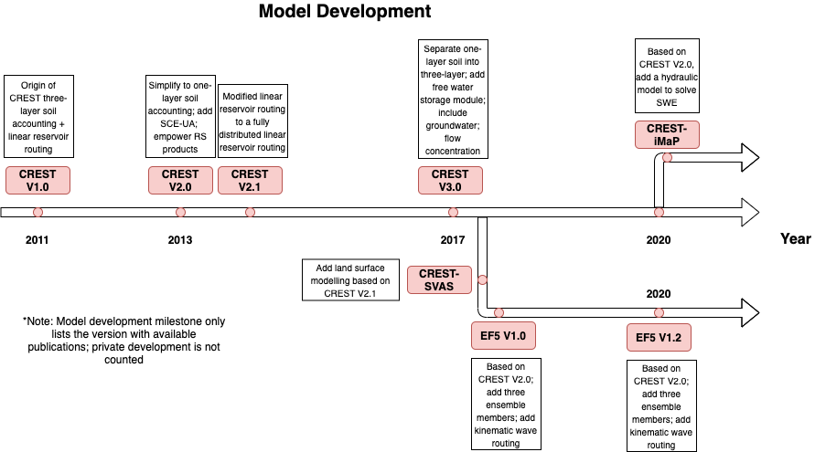

# Rainfall-runoff coefficient

**Miao, C., Zheng, H., Jiao, J., Feng, X., Duan, Q., & Mpofu, E. (2020).
The changing relationship between rainfall and surface runoff on the Loess Plateau, China. Journal of Geophysical Research:
Atmospheres, 125, e2019JD032053. https://doi.org/10.1029/2019JD032053**

In this article, authors examined the rainfall-runoff generation, particularly the coefficient changes over two periods: 1971-1987,
and 2008-2016; This is a decent article to look or review possible attributes of the changing runoff in this specific region (i.e.,
human activity, vegetation, climatology etc.)

One adoptable methodology in this study is to determine the critical point for thresholding runoff throughout Pettitt test.

Main findings:
1. The runoff coefficient decreased greatly in Loess Plateau;
2. The precipitation threshold became greater on the middle regions of the plateau during P2.

# Conceptual planetary hydrology

__Gleeson, T., Wang‐Erlandsson, L., Porkka, M., Zipper, S. C., Jaramillo, F., Gerten, D., et al ( 2020). Illuminating water cycle modifications and Earth system resilience in the Anthropocene. Water Resources Research, 56, e2019WR024957. https://doi.org/10.1029/2019WR024957__

In this big paper, the authors proposed a framework to address the scientific problems: How to determine the tipping point of changes resulting in a irreversiable situation; in other words, what is the maximum changes that breaks the earth system resilience.

Even though this is a conceptual paper, it really motivates researchers to dive into and look for answers to benefit our human society.

# Coupled hydrologic/hydraulic modeling for flood innudation

__A high resolution coupled hydrologic–hydraulic model (HiResFlood-UCI) for flash flood modeling__

UCI group developed the coupling framework of SAC-based hydrologic model and BreZo-based hydraulic model. The advantage of coupling these two can improve the streamflow prediction, and also provide the flood depth and velocity which is crucial to categorize the flood.

__Montanari, M., Hostache, R., Matgen, P., Schumann, G., Pfister, L., & Hoffmann, L. (2009). Calibration and sequential updating of a coupled hydrologic-hydraulic model using remote sensing-derived water stages. Hydrology and Earth System Sciences, 13(3), 367-380.__

In this paper, the authors coupled a parsimonious hydrologic model (3 parameters) with a 1-D hydrodynamic model. The focus of this study is to envision the calibrating schemes by (1) all-in-one calibration and (2) sequential calibration. Not only stream gauge data are used for calibration, the SAR derived extent as well in order to perceive the accuracy of generating flood inundation maps.

__[Flood inundation modelling: A review of methods, recent advances and uncertainty analysis](https://www.sciencedirect.com/science/article/pii/S1364815216310040#!)__

The authors reviewed the development of inundation-driven models based on either emperical/physical. They explicated from modeling domains (1D/2D/3D), different numerical solvers, levels of realisations.

They also sheded lights on the future applications, first, the integration of remotely sensed imageries with physical models throughout data assimilations, the desire for high-performance computations, model uncertainty analysis will continue to play a significant role. 

__[A web based tool for operational real-time flood forecasting using data assimilation to update hydraulic states](https://www.sciencedirect.com/science/article/pii/S1364815216301839)__

In this study, the authors coupled a semi-distributed hydrologic model which is suited fort karst areas along with a hydraulic model (linear lag-and-route model) for flood forecast. The main focus of this study is to update hydraulic states using openDA data assimilation tools.

__[The effect of coupling hydrologic and hydrodynamic models on probable maximum flood estimation](https://www.sciencedirect.com/science/article/pii/S002216941730272X?via%3Dihub#b0225)__

In this article, the author coupled hydrologic model and hydrodynamic model in a way that hydrologic model generated hydrograph is forced as boundary condition in the hydrodynamic model. Unlike other studies that compare the flood extent or depth to observations, they focused on the probable maximum flood. They simply compared coupled model with hydrologic model in 1D representations.

__[Probablistic Numerical Modelling of Compound Flooding Caused by Tropical Storm Matthew over a Data Scarce Coastal Environment](https://agupubs.onlinelibrary.wiley.com/doi/pdf/10.1029/2020WR028565)__

In this article, the authors attempt to quantify the uncertainties of flood mapping due to event rainfall, tide wave propagation, etc. They proposed a coupling framework combining a hydrologic model (HyMOD) and a 2D hydrodynamic model (LISFLOOD-FP) to generate a probablistic flood maps after taking 3000 simulations according to the uncertainties from different rainfall products, model parameterisation, and tide time series.

They concluded that rainfall and ocean wave are the most important contributors to coastal flooding, unsurprisingly.

__[Validation of a full hydrodynamic model for large‐scale hydrologic modelling in the Amazon](https://onlinelibrary.wiley.com/doi/full/10.1002/hyp.8425)__

In this paper, it introduces a lot of needs for developing a coupled model, specifically the deficiences in current hydrologic models. They can be characterized as two main points:

1. issues in river routing are significant in flat river systems like the Amazon and its tributaries, where the influence of sea tide can be up to 1000km upstream. and the subcritical and diffusive flow in Amazon flood wave illustrates the backwater effect which traditional hydrologic model cannot conquer;

2. Floodplain inundation modelling is not available in hydrologic models.

__[AutoRAPID: A Model for Prompt Streamflow Estimation and Flood Inundation Mapping over Regional to Continental Extents](https://onlinelibrary.wiley.com/doi/full/10.1111/1752-1688.12476)__

In this paper, the authors coupled RAPID hydrologic routing module with AutoRoute for hydrodynamic part. For efficiency, they simulated 9 consecutive years of Mississippi river basin within only 45 mins (24 processors and 3-hr time step).

__[Simulation of Hurricane Harvey flood event through coupled hydrologic‐hydraulic models: Challenges and next steps](https://onlinelibrary.wiley.com/doi/full/10.1111/jfr3.12716)__

In this paper, the authors bridge the hydrologic-hydraulic modeling by using VIC+RAPID (hydrologic) and Flood2D-GPU, applied in Harrious county during Hurricane Harvey.

They tested the sensitivity of modelling parameters including initial water depth, roughness, soil moisture, bathymetry, and reservious storage. They used gauged stage time series and HWM interpolated water depth to validate the model performance.

"For a large flood event such as Hurricane Harvey, the effect of the initial water depths is insignificant. The Manning's n values may increase the peak water depth by ~1%, the flood extents by 65km2, and the high danger zone by ~6%. On the contrary, the bathymetry correction factors may reduce the flood extent by ~1.4% and the high‐danger zone by ~4%. Reducing the reservoir storage capacity to 1% may increase the flood extent by ~4% and the high‐danger zone by ~17%."

# Modeling Toolkits

__Multi-objective unstructured triangular mesh generation for use in hydrological and land surface models__

In this paper, the authors introduced a way to construct unstructured meshes based on topographic data and river channel bathymetry to reduce heterorgeneity, which is well-suited for hydrologic/hydrodynamic modeling.

__Flamig, Z. L., Vergara, H., and Gourley, J. J.: The Ensemble Framework For Flash Flood Forecasting (EF5) v1.2: Description and Case Study, Geosci. Model Dev. Discuss., https://doi.org/10.5194/gmd-2020-46, in review, 2020.__

An descriptive paper stating the latest EF5 model and its application to the CONUS.

__[Mesh type tradeoffs in 2D hydrodynamic modeling of flooding with a Godunov-based flow solver](https://www.sciencedirect.com/science/article/pii/S0309170814000360)__

"Unstructured mesh mandates greater overhead to track the neighborhood of data around each cell, and makes it more challenging to compute gradients in the solution because data points do not fall on a regular grid; but unstructured mesh is very appealing for the ease with which meshes can be generated and tailored to the unique geometry of application sites and the ability to locally refine the mesh around areas of interest"

"In areas of high topographic variability, a fine mesh may be required to resolve important flow paths and thus minimize input data errors. Similarly, a relatively fine mesh can be used to resolve sharp flow features such as a hydraulic jump and thus minimize numerical errors."

Computational cost for an explicit finite volume model scales in proportion to the number of cells and the number of time steps.

In this study, a real case dam-break example illustrates the benefits of unstructured grid compared to quadrilateral mesh, that relative coarse grid and medium grid resolution, i.e., 1km, 100m to 10m, the unstructured perform better in terms of the computational efficiency. But ultra-high resolution, the structured is better

__[Influence of mesh structure on 2D full shallow water equations and SCS Curve Number simulation of rainfall/runoff events](https://www.sciencedirect.com/science/article/pii/S0022169412002697)__

In this paper, the arthors compared different types of meshes with different resoltions, including square cells, structured cells, and unstructure cells w/ or w/o local refinement.

The first conclusion is that coarser resolution results in higher surface volume and larger lagged time.

Second, rectangular mesh tends to be less viscous than structured triangular meshes, which he explains triangular mesh is more directionality,

Third, the local refined meshes predict better surface volume, and it performs much better than most structured rectangular mesh and triangular mesh, and better than unstructured mesh.

At last, in terms of computational efficiency, local refined mesh achieves the best tradeoff of accurate results and least computational efforts.

__[SHUD](https://www.shud.xyz/_book/index.html)__

A fully coupled hydrologic model that resolves overland flow, groundwater flow in a unstructured mesh.

__[Enhancing river model set-up for 2-D dynamic flood modelling](https://www.sciencedirect.com/science/article/pii/S1364815215000304#bib7)__

This paper details necessary steps for a hydrodynamic model in the context of flood mapping. Several caveats are drawn, including representing realistic terrain, a coupling between hydrologic model and a hydrodynamic model, and insertion of man-made structures (bridges, buildings, weirs).

__[FWDET–Floodwater Depth Estimation Tool](https://doi.org/10.5194/nhess-2019-78)__

[Github](https://github.com/csdms-contrib/fwdet)

Use remote sensing sources (polygon) and high-resolution DEM to approximate Flood depth.

__[The Landlab v1.0 OverlandFlow component: a Python tool for computing shallow-water flow across watersheds](https://gmd.copernicus.org/articles/10/1645/2017/gmd-10-1645-2017.pdf)__

An efficient way for flood depth estimation, using simplified SWE. In particular, advection term is ignored, similar to LISFLOOD-FP. This model is hosted with Landlab python library.

## Cellular Automata for Fluid

__[Efficient Urban Inundation Model for Live Flood Forecasting with Cellular Automata and Motion Cost Fields](https://www.mdpi.com/2073-4441/12/7/1997/htm)__

The authors implemented Cellular Automata in an urban environment for efficiency. The governing PDE is:

$H_t=H_{t-1}+(\sum{D_{ij,t-1}}-\sum{D_{ij,t}}\frac{\deltat,b^2}+Source$

__[From python scripting to parallel spatial modeling](https://www.computer.org/csdl/pds/api/csdl/proceedings/download-article/12OmNBv2Cjf/pdf)__

A Python module for implementing cellular automata.

__[A Cellular Automata Fast Flood Evaluation (CA‐ffé) Model](https://agupubs.onlinelibrary.wiley.com/doi/10.1029/2018WR023679)__

First attempt to use Cellular Automata, published in WRR.

## DL in flood inundation modeling

__[Clustering-based hybrid inundation model for forecasting flood inundation depths](https://www.sciencedirect.com/science/article/pii/S002216941000106X)__

Early tentative approach to forecast flood inundation depth with ML models. They firstly cluster study domain to different regions that potentially differ in flood response. Then, ANN model is trained on 12-h maximum flood depth, simulated by HEC-RAS and SWMM.

__[Inundation Modeling in Data Scarce Regions](https://arxiv.org/pdf/1910.05006.pdf)__

Google's initiative towards global inundation mapping. They detailed the terrain data they used by reconstructing optical satellite images with 3D depth model, and the hydraulic models empowered by TPU over the globe.

__[Physics Informed Data Driven model for Flood Prediction: Application of Deep Learning in prediction of urban flood development](https://arxiv.org/pdf/1908.10312v1.pdf)__

In this article, the authors used deep learning method to replace SWE. Several DL models are intercompared: CNN, GAN, and GAN with data assimilation. The model is trained to ANUGA 2D FVM solver in a case study in Austin. The speedup is almost 5000 times, compared to ANUGA.

__[An ANN-based emulation modelling framework for flood inundation modelling: Application, challenges and future directions](https://www.sciencedirect.com/science/article/pii/S1364815219307601#bib89)__

In this paper, the authors discussed potentials using ML to emulate flood inundation. They propose ANN based model trained on TUFlow solved water depth (3 historical events and six designed events). A case study in Australia is provided. Inputs, such as flood drivers (i.e., inflow, tidal condition). They used information theory, partial mutual information (PMI) specifically to select most important input features.

One hilight of this work is that they discussed the prospecitve future of using ML model to replace SWE, and they validate the results based on three aspects:   

1. predictive validity: to ensure the model can generalise over the range of calibration data (that is validation step).

2. replicative validity: to ensure the model has captured the underlying relationship in the available data

3. structure validity: Structure validation is “to ensure the model is plausible when compared with a priori knowledge” of the system)

__[Artificial neural network based hybrid modeling approach for flood inundation modeling](https://www.sciencedirect.com/science/article/pii/S0022169420310660#!)__

The authors attempted to generalize ANN model from data-rich regions to data-sparse regions. A hybrid framework is developed, using point-based ANN, block-based ANN (in consecutive times). Point-based ANN turns out to have better generalization.

A framework of their workflow is provided as follows, in which they cluster regions with sufficient data or poor data coverage, and subsequently they construct relationships between data-rich model and data-sparse model.

  

They classified the model domain into data-rich channel and data-sparse flood plain. Within the floodplains, they applied ANNs+ReLU to reclify values above max depth in channel.

  

__[Improvement of Two-Dimensional Flow-Depth Prediction Based on Neural Network Models By Preprocessing Hydrological and Geomorphological Data](https://link.springer.com/article/10.1007/s11269-021-02776-9)__

In this paper, the authors used a set of hydrologic variables e.g., Runoff, roughness, FAR, slope with a latent time to predict flood depth at next time step. The models they used are RNNs, benchmarked on traditional ANNs. One highlight is that they did multi-dimensional cluster to seperate the watershed into different properties based on environmental variables.

# Sensitivity Analysis

__[Sensitivity analysis of environmental models: A systematic review with practical workflow](https://www.sciencedirect.com/science/article/pii/S1364815216300287#bib35)__

In this paper, authors comprehensively reviewed approaches to evaluate the sensitivity issue in environmental modeling, spaning from mapping, rakning, screening purposes and local/global sensitivity. A suit of methodologies such as pertubations, density, correlations are exclusively mentioned.

At the end, they proposed a workflow to dissect the sensitivity from inputs sampling to output post-analysis. 

__[Estimating a-priori kinematic wave model parameters based on regionalization for flash flood forecasting in the Conterminous United States](https://www.sciencedirect.com/science/article/pii/S0022169416303626)__

In this paper, the authors described a way to approximate the simplified 1D-Saint-Venant routing (aka. kinematic wave model) parameters by using historical USGS stream gauge data that links flow rate and depth (i.e., routing curve) and hydroclimatologic data (i.e., precipitation, soil moisture), and terrain (DEM).

This approach has been applied in the CONUS in the rencent 10 years with event-based studies. A satisfactory result has been produced by measuring the flood timing error and flood peak error.

__[MGB-IPH model for hydrological and hydraulic simulation of large floodplain river systems coupled with open source GIS](https://www.sciencedirect.com/science/article/pii/S136481521630189X#bib51)__

[Hodges (2013)](https://www.sciencedirect.com/science/article/pii/S1364815213001898?via%3Dihub) suggested simplified routing methods should be increasingly substituted by hydrodynamic methods in large-scale hydrological models.

river routing and inundation dynamics are processes that, normally, are represented by relatively simple approaches. A recent review of twelve large-scale hydrological models (Kauffeldt et al., 2016) concluded that most of them use kinematic wave or even simpler methods for river flow routing. Huang et al. (2016) tested nine hydrological models in large-scale river basins, four of them not included in the review by Kauffeldt et al. (2016), and all of them have simplified methods for river routing.

In steep terrain regions, adopting simplified river routing methods is not often a problem, but in low relief terrains the results of the hydrological models can be strongly affected if river routing is not adequately represented, for instance, due to floodplain storage and backwater effects (Getirana and Paiva, 2013).

In some cases, there is a need for coupling the land surface scheme with the flow routing and flooding model, because of the loss of volume by infiltration and evapotranspiration in large areas, as reported by Pedinotti et al. (2012) in the Niger river basin, by Paz et al. (2014) in the Pantanal wetlands (South America) and by Bauer et al. (2006) in the Okavango Delta.

In this paper, the authors coupled a semi-distributed hydrologic model with a psedo-2D hydraulic routing scheme. They claimed that, compared to linear reservoir and kinematic wave which are the most common ways, this routing is advanced in simulating non-dendritic catchment and flat areas. And they relates the water level with area to approximate the flooded area.

__[Sensitivity of various topographic data in flood management: Implications on inundation mapping over large data-scarce regions](https://www.sciencedirect.com/science/article/pii/S0022169420309835?dgcid=rss_sd_all&utm_source=researcher_app&utm_medium=referral&utm_campaign=RESR_MRKT_Researcher_inbound)__

In this study, various DEMs obtained from multiple sources are tested to explore its impact on flood modeling.

In their first step, all the DEMs are statistically compared against surface collocated sites. More importantly, they quantify the spatial characteristic of all the DEMs with respect to variogram modeling and power spectrum analysis.

Second, they quantified the uncertainties associated with flood inundation area and flood depth under changing grid resolutions. They reconfirmed the observation: coaser resolution produces more extents.

Third, they explained possible theoritical processes been disrupted for a coarse DEM, including: hydraulic connectivity, interaction between streamflow and tide, and rainfall-runoff mechanisms.

__[Propagation of uncertainties in coupled hydro-meteorological forecasting systems: A stochastic approach for the assessment of the total predictive uncertainty](https://www.sciencedirect.com/science/article/pii/S0169809510002528)__

In this paper, the authors proposed a bivariate meta-gaussian model to quantify the uncertainties by considering behavioural hydrologic simulations. As a matter of fact, they proposed a forecast system that aids to gain higher predictability and reduce uncertainties. 

As a test of gaussianity and homoscedacity, they used Kolmogorov-Smirnov (K-S) and Bartlett tests.

# Review of modern Hydrology

__[Challenges in modeling and predicting floods and droughts: A review](https://onlinelibrary.wiley.com/doi/full/10.1002/wat2.1520)__

In this paper, the authors discussed challenges for modern hydrologic modeling from following perspectives: 1) data, 2) hydrologic modeling, 3) process understanding, and 4) human-water interactions. For each item, they bring up challenges, as well as strategies.

1. Data challenges:

It is tied to lack of data, data accessibility, and data sharing. But more importantly, When data is available, an obstacle is how to choose relavent data, which is event identification. For floods (droughts), trade-offs are present when using peak-over(below)-threshold or annual max (min). It is important to select representative events while obtaining as more events as possible.

2. Process understanding:

It remains unknown for compounding flood/drought drivers from meteorologic and hydrologic perspective. Multi-variate modeling is the key to analyzing the dependencies between one another. The spatial dimension of flood/drought needs to be focuses, such as a severity area-frequency-duration curve instead of site-specified IDF curve. Nonstationary caused by climate change, human interactions is a main challenge for hydrologic evaluations.

3. Modelling and prediction

A right modelling tool should encapsulate physical hydrologic processes and also ackownlege uncertainties in between. Stochastic modelling is prevailing because of obvious uncertainties in and out model simulations. A big take from it is how to strengthen model capacity with 1) better understanding of hydrologic process, 2) incorporating spatial representativeness of hydrologic models, and 3) dissections of transition between flood and drought.

Keys to combat challenges: 1) adopting spatial metrics to hydrologic calibration, 2) calibration on wet condition and evaluate on dry condition or vice versa for simulating transitions, 3) be able to represent non-stationary model parameters.

# Hydrologic Regionalization

__[Investigating regionalization techniques for large-scale hydrological modelling](https://www.sciencedirect.com/science/article/pii/S0022169419300496)__

In this paper, the authors presented unsupervised clustering and supervised clustering for hydrologic regionalization.

# Process-based hydrologic modelling

__Ivanov, V.Y., E.R. Vivoni, R.L. Bras, and D. Entekhabi (2004), Preserving high-resolution surface and rainfall data in operational-scale basin hydrology: a fully-distributed physically-based approach, J. Hydrol., 298, 80-111, doi: 10.1016/j.hrol.2004.03.041__

In this paper, the authors exhaustively described the way to design a process-based modeling framework, and the design of meshes to preserve the variability of topographic inputs. They tested this operational model in three basins in Oklahoma, not only surface flow (discharge) is their concern, but other fluxes and states are included completely to introduce this model.

# CREST family

## CREST 1.0

__Jiahu Wang, Yang Hong, Li Li, Jonathan J. Gourley, Sadiq I. Khan, Koray K. Yilmaz, Robert F. Adler, Frederick S. Policelli, Shahid Habib, Daniel Irwn, Ashutosh S. Limaye, Tesfaye Korme & Lawrence Okello (2011) The coupled routing and excess storage (CREST) distributed hydrological model, Hydrological Sciences Journal, 56:1, 84-98, DOI: 10.1080/02626667.2010.543087__

This paper detailed physical-based process (including water balance model components, sub-grid/downstream routing process). 

The first paper introduced CRESTH model v1.0

## CREST V1.6

__Wu, H., R. F. Adler, Y. Hong, Y. Tian, and F. Policelli, 2012: Evaluation of Global Flood Detection Using Satellite-Based Rainfall and a Hydrologic Model. J. Hydrometeor., 13, 1268–1284, https://doi.org/10.1175/JHM-D-11-087.1.__

CREST V1.6 applied to global flood detection

__S. I. Khan et al., "Satellite Remote Sensing and Hydrologic Modeling for Flood Inundation Mapping in Lake Victoria Basin: Implications for Hydrologic Prediction in Ungauged Basins," in IEEE Transactions on Geoscience and Remote Sensing, vol. 49, no. 1, pp. 85-95, Jan. 2011, doi: 10.1109/TGRS.2010.2057513.__

Regional flood detection with multiple events.

__[Zhang, Y., and Coauthors, 2015: Hydrometeorological Analysis and Remote Sensing of Extremes: Was the July 2012 Beijing Flood Event Detectable and Predictable by Global Satellite Observing and Global Weather Modeling Systems?. J. Hydrometeor., 16, 381–395, https://doi.org/10.1175/JHM-D-14-0048.1.](https://journals.ametsoc.org/jhm/article/16/1/381/5955/Hydrometeorological-Analysis-and-Remote-Sensing-of)__

In this paper, the authors firstly propose a framework by which the Global Forecast System and Global Ensemble Forecast System are incorporated to evaluate the detectability of flood events of the CREST model, as a function of lead time. This work is applied to a basin in Beijing, China at daily resolution.

## CREST V2.0

__[Statistical and hydrological evaluation of TRMM-based Multi-satellite Precipitation Analysis over the Wangchu Basin of Bhutan: Are the latest satellite precipitation products 3B42V7 ready for use in ungauged basins?](https://www.sciencedirect.com/science/article/pii/S0022169413004952#b0160)__

(1) enhancement of the computation capability using parallel distribution techniques to make the model more efficient than the previous version (Wang et al., 2011); (2) model implementation with options of either spatially uniform, semi-distributed, or distributed parameter values; (3) automatic extraction of a-priori model parameter estimates from high-resolution land cover and soil texture data. The physically-based parameters, Ksat and WM, can be derived from land cover types and soil texture data based on a look-up table (Chow et al., 1988); (4) a modular design framework to accommodate research, development and system enhancements; and (5) inclusion of the optimization scheme SCE-UA (Duan et al., 1992, Duan et al., 1993) to enable automatic calibration of the CREST model parameters.

EF5-based CREST is originated here

### EF5

__[Clark, R. A., and Coauthors, 2017: Hydrological Modeling and Capacity Building in the Republic of Namibia. Bull. Amer. Meteor. Soc., 98, 1697–1715, https://doi.org/10.1175/BAMS-D-15-00130.1.](https://journals.ametsoc.org/bams/article/98/8/1697/216095/Hydrological-Modeling-and-Capacity-Building-in-the)__

In this paper, the authors introduced the capacity building of using EF5 to alleviate the flood damages in Africa

__[Martinaitis, S. M., and Coauthors, 2017: The HMT Multi-Radar Multi-Sensor Hydro Experiment. Bull. Amer. Meteor. Soc., 98, 347–359, https://doi.org/10.1175/BAMS-D-15-00283.1.](https://journals.ametsoc.org/bams/article/98/2/347/69988/The-HMT-Multi-Radar-Multi-Sensor-Hydro-Experiment)__

In this paper, the authors pre-tested the hydrologic performance of CREST/EF5 on the use of high-resolution MRMS data in the CONUS, to mark the transition from research to operation. Also the HRRR forecast data are used to forecast floods.

__[Gourley, J. J., and Coauthors, 2017: The FLASH Project: Improving the Tools for Flash Flood Monitoring and Prediction across the United States. Bull. Amer. Meteor. Soc., 98, 361–372, https://doi.org/10.1175/BAMS-D-15-00247.1.](https://journals.ametsoc.org/bams/article/98/2/361/69979/The-FLASH-Project-Improving-the-Tools-for-Flash)__

This paper firstly applies high-resolution MRMS data to the CREST/EF5 framework to forecast flash flood.

__[The Coupling of NSSL Warn-on-Forecast and FLASH Systems for Probabilistic
Flash Flood Prediction](https://journals.ametsoc.org/jhm/article/21/1/123/346094)__

In this paper, the authors show a promising flood forecast framework based on Warn-on-Forecast concept, and integrated into the FLASH project. This is a follow-up study of 2018 Hydro-Met experiment but using ensemble to consider uncertainties.

## CREST V2.1

__[Refining a Distributed Linear Reservoir Routing Method to Improve Performance of the CREST Model](https://ascelibrary.org/doi/10.1061/%28ASCE%29HE.1943-5584.0001442)__

Introduction:

The previous version of the CREST, using linear reservior routing, untruly produces discontinuous runoff, which tends to underestimate channel flow at the outlet point. Therefore, a fully distributed linear reservior routing model is proposed.

By definition, the fully integrated LRR means runoff produced at each trajectory cell is taken into account, instead of directly produced at desired point.

Three case studies are designed to verify the performance gain of the new routing scheme.

__[Comprehensive evaluation of Ensemble Multi-Satellite Precipitation Dataset using the Dynamic Bayesian Model Averaging scheme over the Tibetan plateau](https://www.sciencedirect.com/science/article/pii/S0022169417308156?via%3Dihub#b0080)__

In this paper, the authors applied the CREST to simulate streamflow in Tibetan Plateau, in order to assess the newly developed Ensemble Multi-Satellite Precipitation Dataset using the Dynamic Bayesian Model Averaging scheme algorithm.

A highlight in this study is that the authors explained the errors with either suspection or physics in detail as well as proper citations.

__[A systematic assessment and reduction of parametric uncertainties for a distributed hydrological model](https://www.sciencedirect.com/science/article/pii/S0022169418305699?via%3Dihub#b0345)__

In this paper, the authors adopted a systematic sensitivity analysis of the CREST V2.1, and surrogate modeling to optimize the model and alleviate the computational efforts.

Highlight:

They use surrogate model to represent ensemble members and indicate that the observation is contained in the box (25-75th percentile), which could be used as uncertainty estimation.

__[Assessing the potential of satellite-based precipitation estimates for flood frequency analysis in ungauged or poorly gauged tributaries of China’s Yangtze River basin; J. Hydrol.](https://www.sciencedirect.com/science/article/pii/S002216941730313X?via%3Dihub#b0410)__

The CREST V2.1 was applied to predicting Ungaguged Basins in Chongqing, China for flood frequency analysis. It shows the constructed hydraulic structures i.e., dams, significantly limit the performance of transferred model performance.

### CREST-SVAS

__[A framework to improve hyper-resolution hydrological simulation in snow-affected regions](https://www.sciencedirect.com/science/article/pii/S0022169417303414?via%3Dihub#b0170)__

Introduction:

The land surface model exhibits great uncertainty, especially the snow models, which in turn propagates errors into flow simulations.

In this paper, the authors extended the CREST model with a soil-vegetation-atmosphere layer (vegetation interception, snow accumulation, melting, and refreezing)

Improvements:

1. Three snow layers are added in addition to the CREST, to represent the snow melting, refreezing process.

2. Two ablation schemes (with or without canopy) were implemented.

3. A energy balance is included (only if snow is present)

__[Chen, X., D. Long, Y. Hong, C. Zeng, and D. Yan (2017), Improved modeling of snow and glacier melting by a progressive two-stage calibration strategy with GRACE and multisource data: How snow and glacier meltwater contributes to the runoff of the Upper Brahmaputra River basin?, Water Resour. Res., 53, 2431–2466, doi:10.1002/2016WR019656.](https://agupubs.onlinelibrary.wiley.com/doi/pdf/10.1002/2016WR019656)__

A similar approach to CREST-SVAS, the authors apply the CREST to Tibetan Plateau, in conjunction of a snow-melting model in order to represent the cryosphere there.

The novelty of this paper is not only by introducing a coupled model, but the authors proposed a two-stage calibration, with the use of MODIS derived Snow Water Equivelent for calibrating snow-melting parameters and GRACE derived Total Water Storage (TWS) for calibrating storage. This surrogate approach has profound implication to ungauged basins.

### iCRESTTRIGRS

__[iCRESTRIGRS: a coupled modeling system for cascading flood–landslide disaster forecasting](https://hess.copernicus.org/articles/20/5035/2016/)__

Coupled CREST with a landslide model to predict rainfall-induced landslide.

### WRF-CREST-ADCIRC

__[An Integrated Scenario Ensemble‐Based Framework for Hurricane Evacuation Modeling: Part 2—Hazard Modeling](https://onlinelibrary.wiley.com/doi/full/10.1111/risa.13004)__

In this paper, the authors coupled WRF-CREST-ADCIRC for the purpose of evacuation. The WRF generates ensemble atomospheric forcings for CREST and ADCIRC. Meanwhile, CREST provides upstream boundary conditions to ADCIRC to simulate the storm surges in the coastal region.

## CREST V3.0

__Kan, G.; Tang, G.; Yang, Y.; Hong, Y.; Li, J.; Ding, L.; He, X.; Liang, K.; He, L.; Li, Z.; Hu, Y.; Cui, Y. An Improved Coupled Routing and Excess Storage (CREST) Distributed Hydrological Model and Its Verification in Ganjiang River Basin, China. Water 2017, 9, 904.__

The improvements of CREST V3.0 against V2.x are:

1). Separating the soil layer into three layers and considering tension water, soil moisture, and evapotranspiration computations like in the original version.

2). Adding a free water storage computation module with a free water distribution curve to describe the sub-grid variations of free water storage.

3). According to free water storage, separating runoff into three components, including overland flow, interflow, and ground water.

4). Improving the flow concentration module into a four-mechanism cell-to-cell routing, including overland flow, interflow, ground water, and river channel flow routings. Based on the arrival time of each upstream grid cell to its downstream outlet grid cell, the generated runoff is routed down along the flow concentration path generated according to the eight-flow-direction method.

# Groundwater Hydrology

[Ying Fan](https://scholar.google.com/citations?hl=en&user=oCJH1C4AAAAJ)

__[River basins as groundwater exporters and importers: Implications for water cycle and climate modeling](https://agupubs.onlinelibrary.wiley.com/doi/10.1029/2008JD010636)__

The authors designed the experiment to investigate the long-distance groundwater flow, which reveals the indication of regional and large-scale hydrologic processes. They used the precipitation surplus versus recharge ratio to indicate how groundwater is divided and whether the groundwater in one basin is importer or exporter. This groundwater budget is highly relied on the topography, climate, and basin characteristics (geology).
